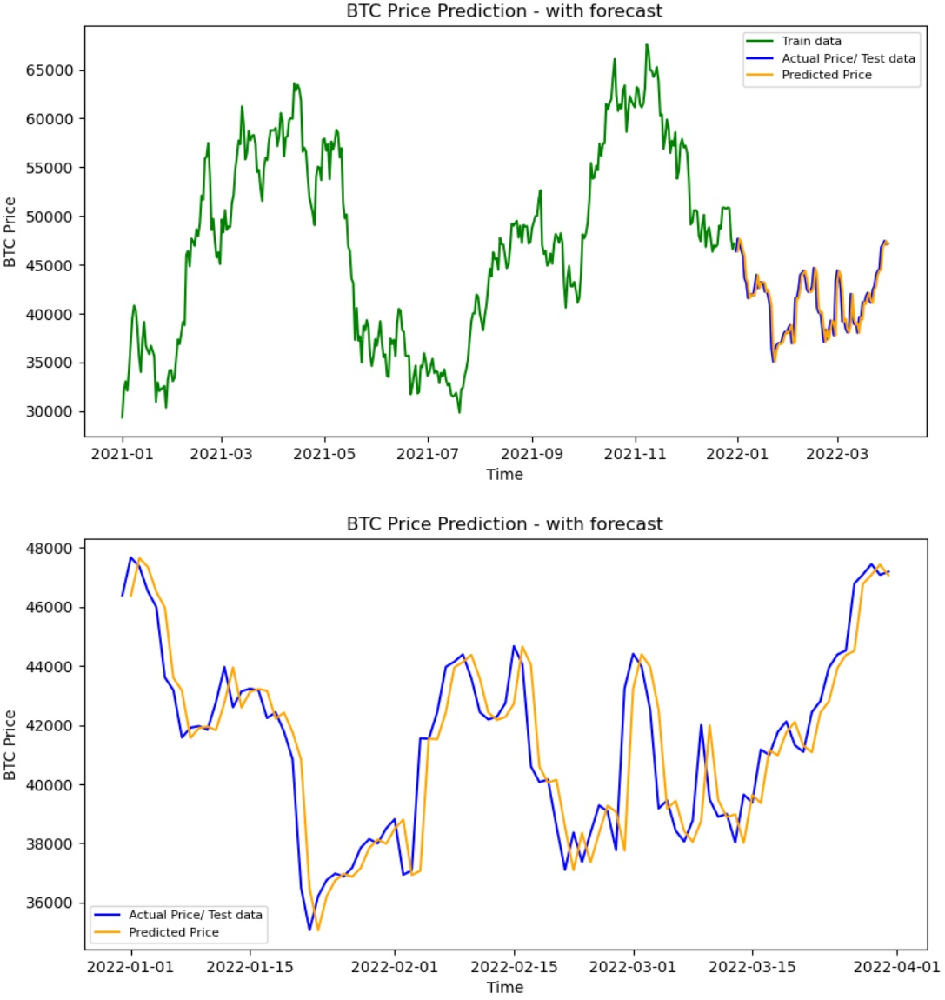

# Readme for Bitcoin Price Prediction Project with ARIMA, XGBoost and LSTM
### Bootcamp Data Science PRO - Kodołamacz - DS 11/09/2021

Complete project consists of three notebooks with sections as below.

1. Abstract
2. Data description
3. Gathering data
4. Data preprocessing
5. ARIMA Model
    - 5.1. ARIMA  =>  Introduction
    - 5.2. ARIMA Model  =>  function definition
    - 5.3. ARIMA Model  =>  Forecasting
        - complete data
        - data start from 2018-01-01
        - data start from 2021-01-01
    - 5.4. ARIMA Model  =>  summary
6. XGBoost
    - 6.1. XGBRegressor  =>  Introduction
    - 6.2. XGBRegressor  =>  function definition
    - 6.3. XGBRegressor  =>  Forecasting
        - complete data
        - data start from 2018-01-01
        - data start from 2021-01-01
    - 6.4. XGBRegressor  =>  summary
7. LSTM Model
    - 7.1. LSTM  =>  Introduction
    - 7.2. LSTM  =>  function definition
    - 7.3. LSTM  =>  Forecasting
        - complete data
        - data start from 2018-01-01
        - data start from 2021-01-01
    - 7.4. LSTM  =>  summary
8. Project summary

## 1. Abstract

In "BTC_Price_Prediction - ARIMA.ipynb" notebook, this chapter contains short Bitcoin description and why price forecasting may be helpful.
Here, in readme file, I have placed screenshot from one of the predictions made in this project.
Enjoy :)

Project notebooks:
- "01_BTC_Price_Prediction - ARIMA.ipynb"
- "02_BTC_Price_Prediction - XGBoost.ipynb"
- "03_BTC_Price_Prediction - LSTM.ipynb"

## 2. Data description

Historical data price has been taken from Coinpaprika API Python Client.
- Web Site - https://coinpaprika.com/waluta/btc-bitcoin/
- Github   - https://github.com/s0h3ck/coinpaprika-api-python-client

Coinpaprika is a popular data source for various cryptocurrencies, with Polish origins based in city of Poznań.
Free Coinpaprika API provides data in JSON, and has limitation for amount of data per request. For example maximum of 50 tweets or historical data for at most 365 days at one request.
Examples of use can be found in their Github site.